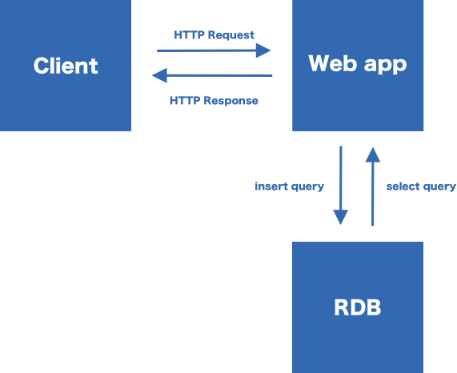

# リレーショナルデータベース(RDB)



Webサービスをユーザーに提供するにあたって、大抵の場合にはデータの永続化が必要になるでしょう。一般的にはリレーショナルデータベース(以下RDB)を用います。RDBはその名前の通り、リレーショナルモデルをベースに設計されているデータストレージです。RDB以外にもキーバリューストアやドキュメント指向、グラフデータベースなどが存在します。それぞれ向き・不向きがあるのでユースケースに応じて使うデータベースを選ぶべきでしょう。

RDBはいくつかの単位でデータが構成されます。最小の単位は「カラム」で、カラムを複数格納する「レコード」、レコードを複数格納する「テーブル」、テーブルを複数格納する「データベース」となっています。シンプルなWebアプリケーションでは1つのデータベースを用いてデータを管理します。

テーブルはその名前の通り表でデータを表現することができます。例えばユーザー情報を表現するテーブルは以下の様になります。

| ID | 名前 | 職業 |
| --- | --- | --- |
| 1 | 赤松 祐希 | プログラマ |
| 2 | 料理 する太郎 | 料理家 |

このテーブルの1行、1行がレコードになります。レコードに格納されている項目がカラムです。

## SQL

RDBではデータの取得や保存や更新、削除にSQLと呼ばれる問い合わせ言語を用います。例えばusersと名付けられたユーザー情報を格納しているテーブルからレコードを取得したい場合は以下のクエリを実行します。

```sql
> select * from users;
 id |     name      |    job
----+---------------+------------
  1 | 赤松 祐希     | プログラマ
  2 | 料理 する太郎 | 料理家
```

`select` が名前の通り取得するための命令となっており、その後ろの`*` は全てのカラムを意味しています。上記のクエリを試すには[./samples](./samples)にあるファイルを実行し、データベース及びテーブル・レコードを作成してください。 その後、`psql`コマンドを実行し、SQLを入力し実行します。

```
$ cd ./docs/examples
$ ./create_db.sh
$ ./create_table.sh
$ psql waseda_sample -U waseda_sample
> select * from users;
```

テーブルから全レコードを取得したいというケースよりも、なんらかの条件で絞りこんだり、一定の順番に並び換えたいというケースの方が多いでしょう。また特定のカラムだけ欲しいというケースもあります。その場合、以下の様に指定することが可能です。

```sql
> select id, name from users; /* IDと名前だけ */
> select * from users where name = "赤松 祐希"; /* 名前が赤松 祐希のものだけ */
> select * from users order by id desc; /* IDの降順で */
```

他にも様々なオプションがあり、それらの組み合わせによってデータを抽出したり、更には加算する、平均をとるなどの集計も可能です。

`select` 以外にもレコードを挿入する`insert`、更新する`update`、削除する`delete`などがあります。PostgreSQLで扱えるSQLについては[PostgreSQL: Documentation: 11: Part II\. The SQL Language](https://www.postgresql.org/docs/11/sql.html)で確認可能です。
